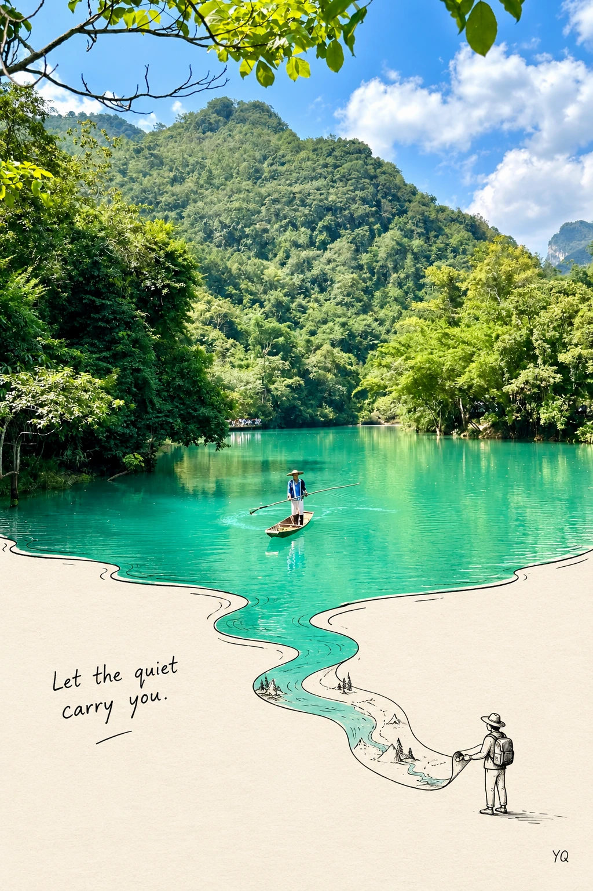
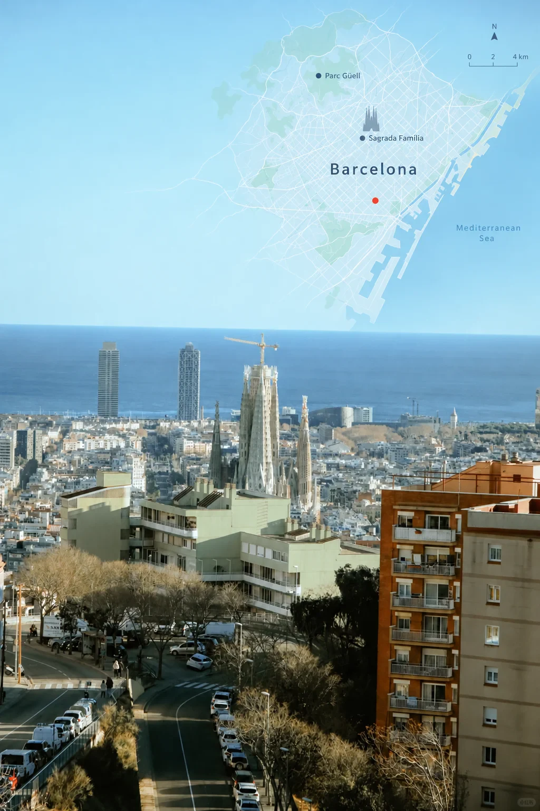
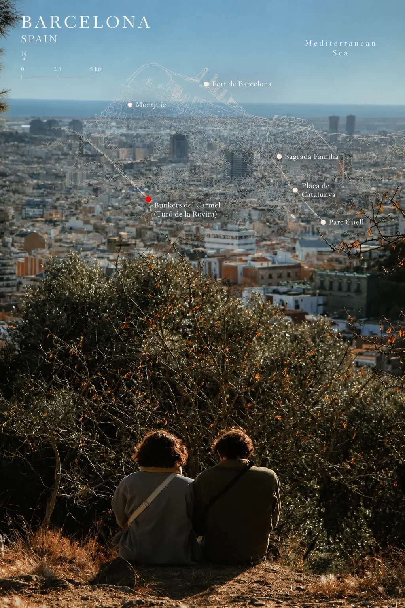

# Awesome Image Prompts

A curated prompt library for image generation and image editing products.

The repository is designed to be both human-readable and product-friendly:

- `manifest.json` lists available prompt collections.
- `categories.json` defines the category tree.
- `prompts/*.json` contains structured prompt records for product ingestion.
- `assets/` stores lightweight preview images when a prompt needs a local cover.

## Collections

| ID | Name | File | Description |
| --- | --- | --- | --- |
| `outdoor` | 户外风格 / Outdoor Style | `prompts/outdoor.json` | Outdoor, travel, hiking, camping, road trip, natural light, geo-map overlays, and lifestyle image prompts. |

## Featured Prompts

### 实景延伸线稿旅行海报

- Category: `outdoor`
- Subcategory: `travel-poster`
- Needs reference image: `true`
- Source: [小红书笔记](https://www.xiaohongshu.com/explore/6ab3b664000000000100acfe)

This prompt turns an uploaded travel or outdoor photo into a 2:3 poster: the top half preserves the original photo, while one real element from the photo continues into the lower half as black line art and interacts with a tiny pen-drawn figure.

### 地理坐标叠加旅行摄影

- Category: `outdoor`
- Subcategory: `geo-map`
- Needs reference image: `true`
- Source: [小红书笔记](https://www.xiaohongshu.com/explore/6ac76768000000000100a641)

This prompt keeps a travel photo intact and overlays a translucent real-world map (city streets, coastline, contour lines, mountain terrain, trails) into negative space such as sky or sea, marking the shooting location with a single small red dot and adding a few low-saturation English place labels for an editorial travel-zine look. Fill in the shooting location in the `【】` placeholder before sending.

### 地理坐标自动识别旅行摄影

- Category: `outdoor`
- Subcategory: `geo-map`
- Variant of: `outdoor-geo-map-travel-photo`
- Needs reference image: `true`
- Source: [小红书笔记](https://www.xiaohongshu.com/explore/6ac76768000000000100a641)

Same visual style, but the location is no longer a manual placeholder. The prompt uses a graded ladder: use supplied GPS/GeoJSON when present, otherwise let the model name the place only when a clearly identifiable city-level landmark is in frame, and fall back to a nameless geo-visual (contour lines, graticule, compass) when confidence is low. Fabricated coordinates, street names and scale numbers are explicitly forbidden. The pipeline for reading EXIF and reverse-geocoding coordinates lives in [docs/auto-locate.md](docs/auto-locate.md).

## Community Picks

`prompts/outdoor.json` also holds 20 outdoor prompts curated from public Xiaohongshu notes (published 2026-07 through 2026-10), covering postcard diptychs, photo collage, geo map overlays, magazine-look retouching and color grade transfer. Every record keeps the original author, the note URL and the publication date.

Transcription rules:

- The prompt text is transcribed verbatim from the note body. Nothing was rewritten, reworded or extended.
- Only the author's intro chatter, promotional lines and hashtags in front of the prompt were removed.
- Two notes whose prompt lived inside an image (or in the comments) were dropped instead of being stored empty.
- Covers are 800px WebP thumbnails; the original note keeps the full-resolution version.

## Schema

Each item in `prompts/*.json` should include:

- `id`: stable slug-style ID.
- `title`: display title.
- `category` and `subCategory`: category IDs from `categories.json`.
- `modelHints`: model or workflow hints such as `image-edit`, `gpt-image`, `nano-banana`, or `reference-image`.
- `needsReferenceImage`: whether the prompt expects an uploaded image.
- `variantOf`: optional ID of the base prompt when this record is an improved variant.
- `tags`: searchable tags.
- `prompt`: positive prompt text.
- `negativePrompt`: things to avoid.
- `source`: attribution and provenance.
- `assets`: local or remote preview images.

## Asset Policy

Small preview images can live under `assets/`. If the collection grows large or needs production-grade delivery, move images to object storage or a CDN and keep the final URLs in `assets.cover` and `assets.images`.
